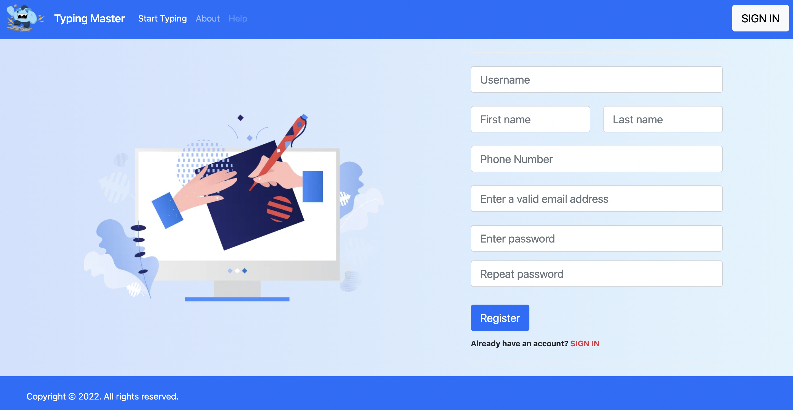
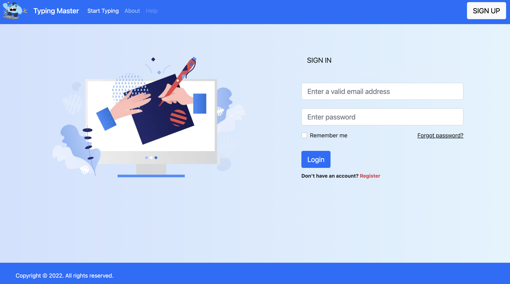
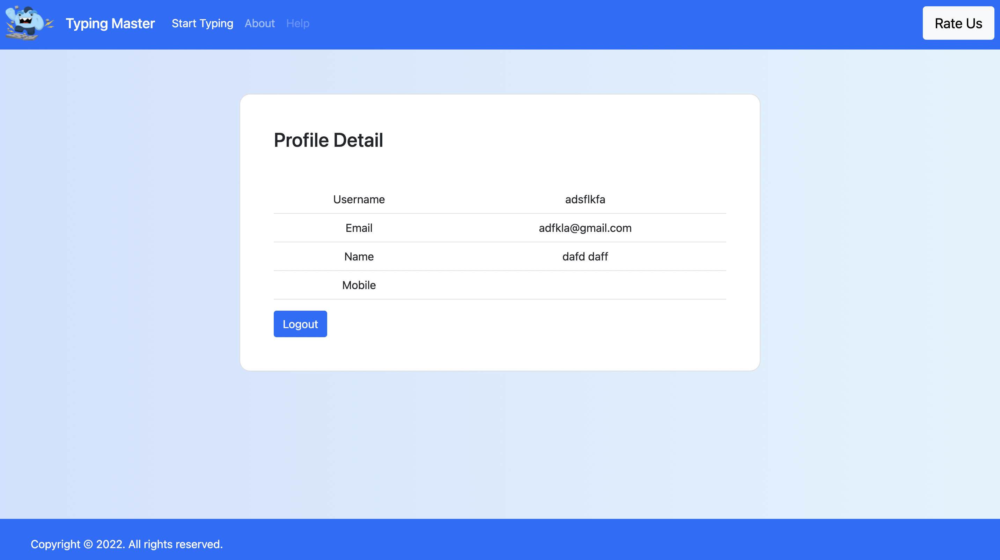
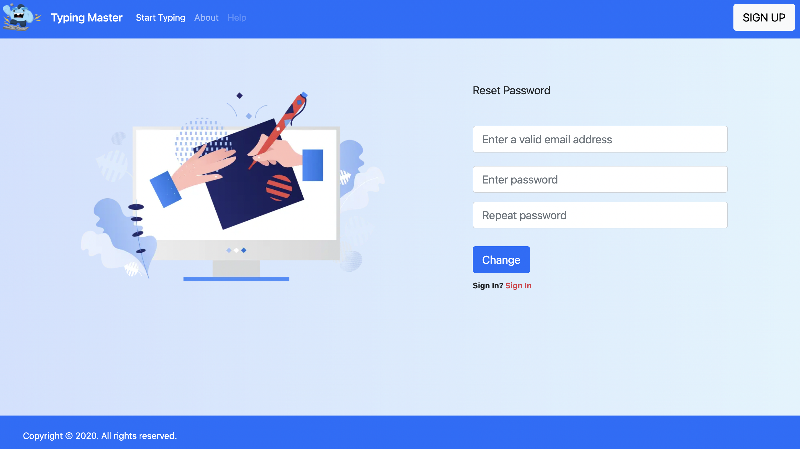
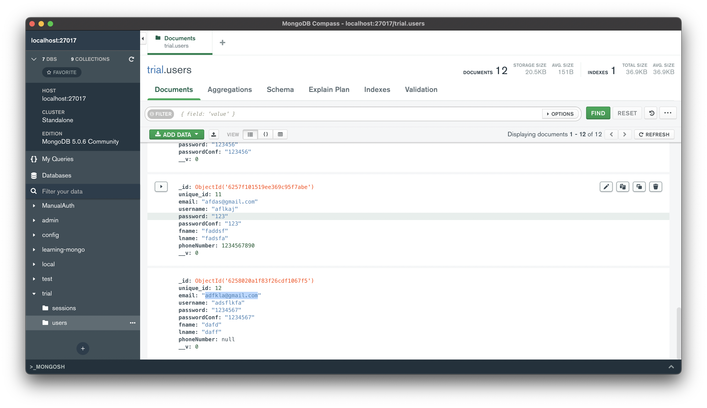
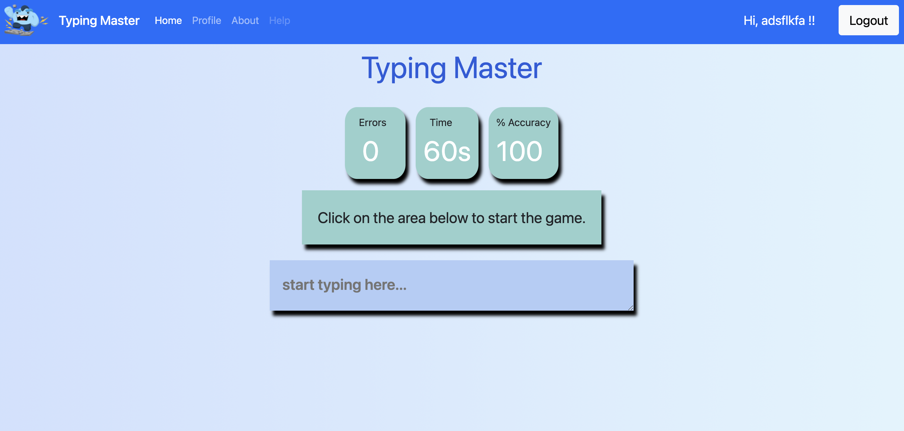
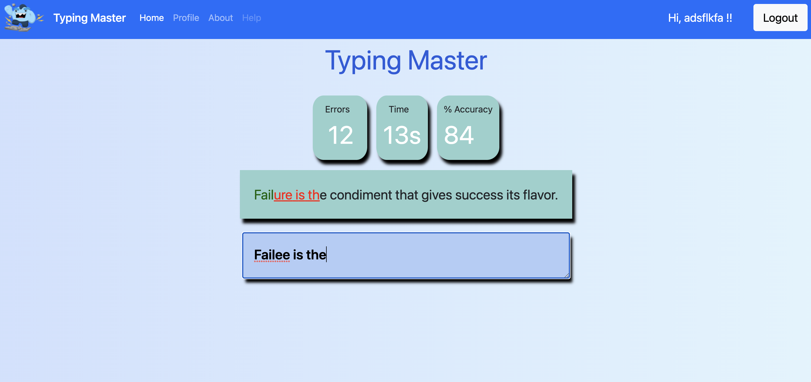
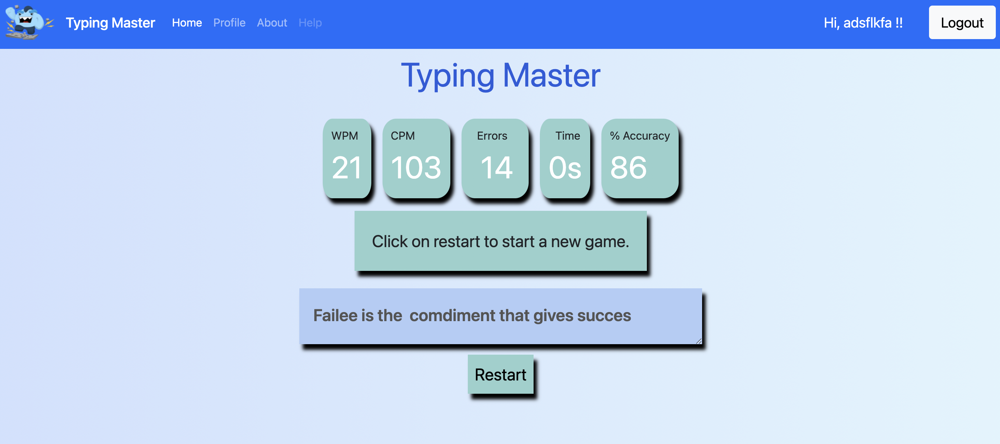

<h1 align="center">
    <b>Typing Master (NodeJs, MongoDB,Express) </b> 
<br>
</h1>


<p align="center">
  Developed by Saurabh Kumar and Shubham Kumar
</p>


## What is this for?
This is a Simple Typing Speed Checking Website with User Registration & Login systems app done with Node.js Framework using MongoDB(Compass) as the data store, Express as the routing system, Body-parser as the parser for webpage, Express-session used  to track the user's session and of course Mongoose to make interacting with Mongo from Node easy.

## Getting Started

### Deployment
Yet to be Deployed.

## Running the tests

### •Registration Form:
Allows the user to register their account by filling their Email, Username, Password, Name, Phone Number.



### •Login Form:
If the user has been registered on the app, can login by passing the credentials.



### •User's Profile:
After the user logged in, a simple profile with the user's username, email, full name and mobile number <br>displayed with a session Logout button.



### •Password Reset:
If the user forget his/her password, can reset by entering the registered Email id <br> and reset the password.



### DataBase:
Here we use **[MongoDB Compass(Local Database)]('mongodb://localhost:27017/trial')** as the database. Here we have two collection created, named as:
- users.
- sessions.

A Collection(**Users**) is populated with the user's credentials.

<br><br>

### Typing Test Starting Page:
If the user logged in to his account, he can give the typing test by start typing in the text area <br> and check his speed.



### Typing Test Intermediate Page:
While giving the speed test the correct typed char are blurred out while <br> the wrong ones are underlined in red color. The timer countdown is shown.



### Typing Test Result Page:
After the test, results are shown, like WPM, CPM, Errors, Time and %Accuracy<br> Restart button is shown to restart the test.



## Prerequisites
Tools that we need to run this app:

- ***[Node.js](https://nodejs.org/en/)***
- ***[Node Package Manager](https://www.npmjs.com/get-npm)***
- ***[MongoDB (Compass)]('mongodb://localhost:27017/trial')***

## Installing
```
npm install
```
## Connection to DataBase Access
At line 11 on ```./server.js``` change ***```<DB_USERNAME>```*** with your DataBase UserName & ***```<DB_PASSWORD>```*** with your DataBase Password.

## To Run the App
```
node server.js
```

The server will start Running on
+ http://localhost:3000/


## Authors

Saurabh Kumar(B20CS062)
<br>
Shubham Kumar(B20CS069)

## Purpose

A Software Engineering Project
<br>
Supervisor: Dr. Sumit Kalra

## Acknowledgments

* Hat tip to anyone whose code was used.
* Special mention to all the Nodejs dev's on youtube 😜

<br><br>

